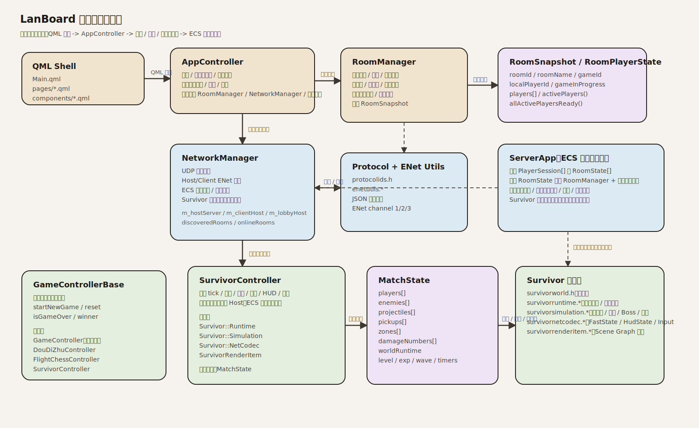
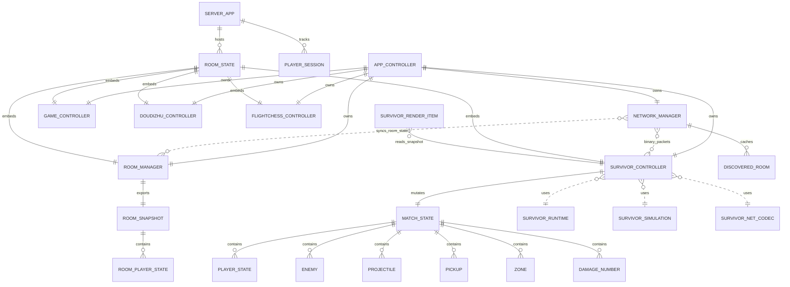

# LanBoard（桌域）

一个基于 `Qt 6 + Qt Quick + QML + C++` 的多游戏联机项目，目标不是只做几个单机页面，而是统一：

- 页面壳层与导航
- 房间 / 座位 / 准备 / 开局规则
- 局域网与 ECS 在线大厅
- 多个游戏控制器的生命周期
- `Survivor` 的本地与在线战斗链路

当前主线已经具备课程大作业所需的完整度：可本地运行、可局域网演示、可连接 ECS 在线大厅、可构建桌面端与 Android APK，并附带部署文档和开发日志。

## 游戏与模式

当前仓库包含 4 个游戏入口：

- `五子棋`：双人回合制棋盘对弈
- `斗地主`：三人联机纸牌
- `飞行棋`：双人回合制桌游
- `Survivor MVP`：自动攻击生存原型，已接入本地战斗、房间流转和在线联机战斗

当前支持的运行模式：

- `本地模式`
- `局域网联机`
- `在线联机（ECS 房间大厅）`
- `独立服务端`

说明：

- 局域网发现使用 `UDP 广播`
- 房间与实时消息使用 `ENet / UDP`
- ECS 在线大厅与在线房间由 `lanboardServer` 提供

## 当前完成度

### 已完成

- 首页统一展示游戏入口与简介
- 房间页统一承载局域网扫描、手动加入、在线房间列表、创建房间与房间状态
- 设置通过 `QSettings` 持久化保存
- 房间支持最多 `8` 人，区分 `游戏位 / 旁观位`
- 房主可在房间内切换当前游戏
- 切换游戏时按目标游戏的人数规则自动整理座位
- 对局结束后自动回房并清空准备状态
- Android 与桌面端都可构建
- ECS 独立服务端可单独部署并常驻运行

### 联机覆盖

- `五子棋`：本地、局域网、在线房间、大厅服务端
- `斗地主`：本地、局域网、在线房间、大厅服务端
- `飞行棋`：本地、局域网、在线房间、大厅服务端
- `Survivor MVP`：本地可玩，在线联机战斗已打通，仍在持续调优同步、节奏与性能

## 架构总览

项目现在不是“页面各写一套逻辑”，而是围绕 5 层组织：

1. `QML Shell`
   - `qml/Main.qml` 负责应用窗口、底部导航、页面切换和返回逻辑
   - `qml/pages/*.qml` 负责具体页面和交互表现
   - `SurvivorPage.qml` 使用 `SurvivorRenderItem` 做自定义战斗渲染

2. `App 协调层`
   - `src/app/AppController`
   - 统一持有 `RoomManager / NetworkManager / 各游戏控制器`
   - 负责导航、设置持久化、房间流转、开局/结算和网络事件分发

3. `房间与规则层`
   - `src/lobby/RoomManager`
   - `src/common/roomtypes.h`
   - `src/common/types.h`
   - 统一定义房间快照、玩家座位、准备状态、每个游戏的开局人数规则和页面路由

4. `网络层`
   - `src/network/NetworkManager`
   - `src/network/RoomDiscoveryService`
   - `src/network/networkaddressutils.*`
   - `src/network/protocolids.h`
   - `src/network/enetutils.*`
   - 同时承载：
     - `RoomDiscoveryService` 负责局域网 UDP 广播发现和同房间多端点聚合
     - `networkaddressutils` 负责网卡地址筛选与端点优先级判断
     - Host/Client 直连 ENet 会话
     - ECS 在线大厅 / 在线房间连接
     - Survivor 二进制快照与输入包

5. `游戏层`
   - `src/common/GameControllerBase`
   - `src/game/GameController`（五子棋）
   - `src/game/DouDiZhuController`
   - `src/game/FlightChessController`
   - `src/game/SurvivorController`
   - 其中 `Survivor` 还拆成：
     - `survivorworld.h`：核心数据结构
     - `survivorruntime.*`：通用运行时计算与渲染快照导出
     - `survivorsimulation.*`：波次、升级表、命中参数、数值规则
     - `survivornetcodec.*`：二进制网络编解码
     - `survivorrenderitem.*`：QSG 渲染层

## 核心对象关系

### 1. AppController 是总调度器

`AppController` 持有并协调：

- `RoomManager`
- `NetworkManager`
- `GameController`
- `DouDiZhuController`
- `FlightChessController`
- `SurvivorController`

它负责做三类事情：

- `页面导航`
  - 例如从首页进入房间页、从房间页进入具体游戏页、结算后回房
- `模式切换`
  - 本地模式、局域网 Host、局域网 Client、ECS 在线房间
- `事件桥接`
  - 把 `NetworkManager` 收到的远端消息转发给对应控制器
  - 把控制器产生的输入、结算、同步请求再发回网络层

### 2. RoomManager 统一房间语义

`RoomManager` 不直接管网络，也不直接管 QML 页面样式。它只负责：

- 玩家列表
- 房主 / 普通玩家
- 游戏位 / 旁观位
- 准备状态
- 当前房间游戏
- 是否允许开始

它输出的核心数据是 `RoomSnapshot`，页面和网络都围绕这个快照工作。

### 3. NetworkManager 同时覆盖三种网络职责

`NetworkManager` 里实际上并行存在三条能力：

- `UDP Discovery`
  - 周期性广播局域网查询
  - Host 广播自己的房间公告
  - 客户端维护 `discoveredRooms`

- `Host/Client ENet`
  - Host 模式下本机启动 `m_hostServer`
  - 客户端直连 Host 时使用 `m_clientHost + m_serverPeer`
  - 这条链路主要用于局域网房间

- `Online Lobby / Dedicated Server ENet`
  - `requestOnlineRooms()` 通过 `m_lobbyHost + m_lobbyPeer` 拉房间列表
  - `createOnlineRoom()` / `joinOnlineRoom()` 通过 `m_clientHost + m_serverPeer` 进入 ECS 房间
  - Survivor 在在线模式下额外走二进制快照包

### 4. ServerApp 是独立服务端入口

`src/server/ServerApp` 不是简单消息转发器，而是在线大厅和在线房间的实际宿主：

- 一个 `ServerApp`
- 维护多个 `RoomState`
- 每个 `RoomState` 内部各自持有：
  - `RoomManager`
  - `GameController`
  - `DouDiZhuController`
  - `FlightChessController`
  - `SurvivorController`

也就是说，在线模式下每个房间在服务端都有一套独立的房间状态与游戏控制器实例。

### 5. Survivor 是项目里最完整的一套子系统

`Survivor` 已经不只是一个普通 `QObject` 控制器，而是一个小型运行时：

- `MatchState`
  - 玩家、敌人、投射物、经验球、区域伤害、伤害数字
- `SurvivorController`
  - 驱动 tick、输入、升级、宝箱、联网同步、结算
- `Survivor::Runtime`
  - 负责派生属性、镜头锚点、渲染快照
- `Survivor::Simulation`
  - 负责升级表、武器参数、波次、Boss、事件、经验曲线
- `Survivor::NetCodec`
  - 区分 `FastState / HudState / Input / ChooseLevelUp / CloseChest`
- `SurvivorRenderItem`
  - 用 Scene Graph 渲染玩家、敌人、投射物、圣池、雷达等

## 实体关系图

导出版 SVG：

- [design/lanboard-architecture-erd.svg](design/lanboard-architecture-erd.svg)

README 内嵌版：



Mermaid 版本：



## 运行链路

### 本地模式

`QML 页面 -> AppController -> RoomManager / 对应 GameController`

不经过网络层。

### 局域网 Host/Client

- Host：
  - `AppController` 启动 `NetworkManager::startServer()`
  - `RoomManager` 维护本机房间
  - Host 广播局域网房间公告

- Client：
  - 通过广播发现房间，或手动输入 `IP + 端口`
  - 加入后接收 `room_state`
  - 对局消息回传给 Host，由 Host 统一广播

### ECS 在线模式

- 客户端先向 ECS 拉取房间列表
- 创建或加入房间后，由 `ServerApp` 在服务端为该房间维护状态
- 房间状态和普通游戏消息走 JSON
- `Survivor` 的实时战斗状态走二进制包

## 项目结构

```text
LanBoard/
├── qml/
│   ├── Main.qml
│   ├── components/        通用视觉组件
│   └── pages/             首页 / 房间 / 设置 / 各游戏页面
├── src/
│   ├── app/               AppController，总调度
│   ├── common/            公共类型、房间快照、控制器基类
│   ├── lobby/             RoomManager 与房间规则
│   ├── network/           UDP 发现、地址选择、ENet、协议与在线大厅
│   ├── game/              四个游戏控制器与 Survivor 子系统
│   └── server/            独立服务端入口 ServerApp
├── tests/                 可由 CTest 重复运行的回归测试
├── design/                设计稿、架构图等静态资源
├── NETWORK_DISCOVERY.md   局域网发现机制与过渡兼容说明
├── ECS部署流程.md
├── 技术开发日志.md
└── CMakeLists.txt
```

## 构建

### 桌面端

桌面构建统一使用 `qt-mingw-desktop` 预设，输出目录为 `build-qt-ascii`。
该预设使用 Qt `6.10.3`、MinGW `13.1.0`、Ninja，并显式启用 CTest。

配置：

```powershell
cmake --preset qt-mingw-desktop
```

编译：

```powershell
cmake --build --preset qt-mingw-desktop
```

补齐桌面运行时：

```powershell
C:\Qt\6.10.3\mingw_64\bin\windeployqt.exe --release --qmldir qml build-qt-ascii\appLanBoard.exe
```

产物：

```text
build-qt-ascii/appLanBoard.exe
build-qt-ascii/lanboardServer.exe
```

### 自动化测试

桌面配置默认启用 CTest。构建完成后运行：

```powershell
ctest --preset qt-mingw-desktop
```

当前注册三套回归测试。

`room-manager-regressions` 覆盖：

- 玩家 ID、房间容量和重复加入校验。
- 四种游戏的开局人数、准备状态与房主权限。
- 游戏位、旁观位、棋子编号和座位容量规则。
- 切换游戏、玩家离开、对局结束后的状态整理。
- 房间快照和服务端房间消息字段一致性。

`app-controller-regressions` 覆盖：

- 座位切换作用于实际请求者。
- 连接进行中不会被误判为断开。
- 主动切换游戏或网络模式时不会产生中间房间导航。
- 房主点击开始后会在本机启动游戏并进入对应页面。
- 五子棋双方都可以在任意回合认输并正确结算胜者。
- 客户端断开后清理斗地主和房间状态。
- 五子棋最后一步先于 `game_over` 到达对端。
- 飞行棋结算在当前移动处理完成后执行。

`network-discovery-regressions` 覆盖：

- RFC1918、loopback、link-local、multicast 和保留 IPv4 地址判断。
- 同子网物理网卡优先于 VPN 端点。
- 同一 `roomUid` 的多端点聚合、自发现过滤与端点过期。
- 缺少 `roomUid` 的公告拒绝以及真实 UDP 数据报解析。

### Android

当前常用构建目录：

```text
build-android-clean/
```

构建 APK：

```powershell
cmake --build build-android-clean --target apk --parallel 8
```

产物：

```text
build-android-clean/android-build/build/outputs/apk/release/android-build-release-unsigned.apk
build-android-clean/LanBoard-android-arm64-release-signed.apk
```

### 独立服务端

如需只构建服务端：

```powershell
cmake -S . -B build-server -G Ninja `
  -DCMAKE_PREFIX_PATH="C:\Qt\6.10.3\mingw_64" `
  -DLANBOARD_BUILD_APP=OFF `
  -DLANBOARD_BUILD_SERVER=ON
cmake --build build-server --parallel 8
```

说明：

- `appLanBoard` 是桌面 / Android 客户端
- `lanboardServer` 是 ECS 上的在线大厅与在线房间服务端
- 在线模式下，`ServerApp` 会为每个房间持有自己的 `RoomManager + 游戏控制器`
- `Survivor` 在线战斗已接入服务端控制器与二进制快照同步

## 相关文档

- [ECS部署流程.md](ECS部署流程.md)
- [技术开发日志.md](技术开发日志.md)
- [测试验证报告.md](测试验证报告.md)
- [Qt安装流程.md](Qt安装流程.md)
- [Git协作流程.md](Git协作流程.md)

## 常见问题

### 1. `cannot open output file appLanBoard.exe: Permission denied`

桌面程序还在运行，占用了输出文件：

```powershell
Get-Process appLanBoard -ErrorAction SilentlyContinue | Stop-Process -Force
```

### 2. 局域网发现不到房间

优先检查：

- 双方是否在同一局域网
- 房主是否已经创建房间
- 路由器或系统防火墙是否拦截 UDP 广播
- Android 端是否使用支持局域网广播的 Wi-Fi 网络

### 3. 在线房间连不上

优先检查：

- 设置页中的 `在线服务器 Host / Port` 是否正确
- ECS 的 `44567/udp` 是否放行
- `lanboard.service` 是否正常运行

### 4. Survivor 当前是什么状态

它已经不再是“纯本地 Demo”，而是：

- 可本地试玩
- 可进入房间
- 可在线联机战斗
- 已接入升级、宝箱、HUD、雷达、结算与实时同步

当前仍在继续打磨：

- 多人同步细节
- 高密度场景性能
- 数值节奏与特效表现
